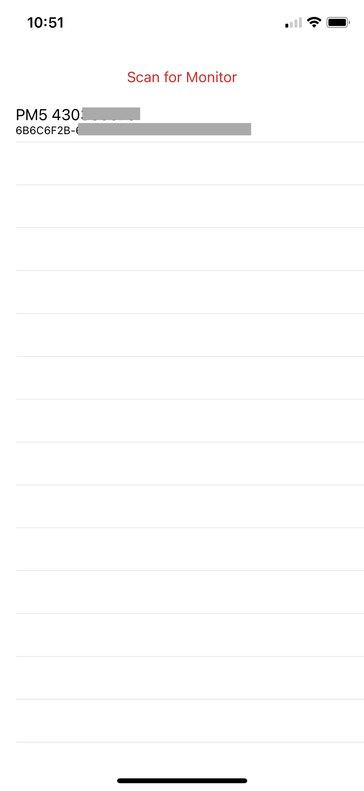
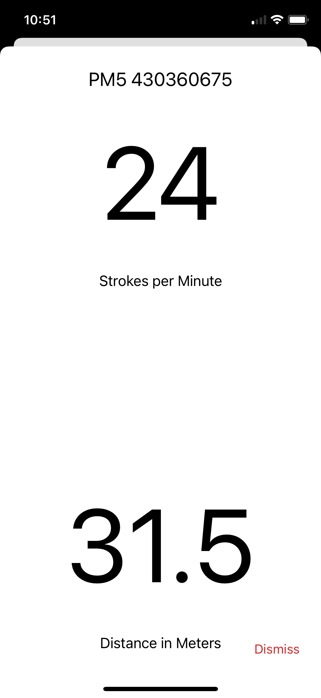

# Concept 2 - Rowing

This is a small POC/Sample application which allows you to connect to a PM5 via bluetooth from a iOS device and receive realtime data from the Concept 2. The original framework included in this repo is based on a fork of the 5 year old <a href='https://github.com/BoutFitness/Concept2-SDK'>Concept2-SDK</a> which I ported to Swift 5.

## Usage

Download or fork the repo, open the XCode project and run it on your device. Enable bluetooth on your Concept2 Rower.

<b>Note</b>: You will need to connect a physical device as the simulator does not support Bluetooth.

## Information

The Concept2-SDK is very well written and includes types for all the major activities and workout options. If you would like to read more/enhance the application, the full bluetooth spec of Concept2 is available: http://www.concept2.com/files/pdf/us/monitors/PM5_BluetoothSmartInterfaceDefinition.pdf

## License

The Concept2-SDK (included in this project) is available under the MIT license and this project itself is also licensed as MIT.